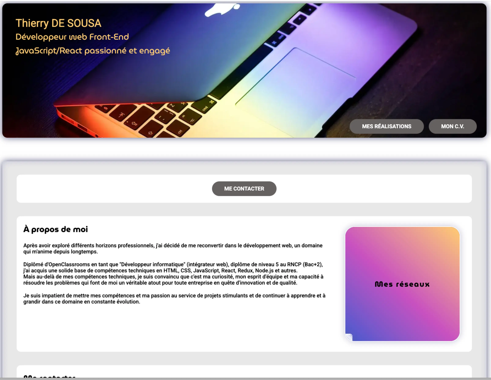

# Getting Started with Create React App

This project was bootstrapped with [Create React App](https://github.com/facebook/create-react-app).

## Available Scripts

In the project directory, you can run:

### `npm start`

Runs the app in the development mode.\
Open [http://localhost:3000](http://localhost:3000) to view it in your browser.

The page will reload when you make changes.\
You may also see any lint errors in the console.

### `npm run build`

Builds the app for production to the `build` folder.\
It correctly bundles React in production mode and optimizes the build for the best performance.

The build is minified and the filenames include the hashes.\
Your app is ready to be deployed!

See the section about [deployment](https://facebook.github.io/create-react-app/docs/deployment) for more information.

## Learn More

You can learn more in the [Create React App documentation](https://facebook.github.io/create-react-app/docs/getting-started).

To learn React, check out the [React documentation](https://reactjs.org/).

## Mon portfolio - Projet de soutenance n°12 de la formation Développeur Intégrateur Web

Dans ce projet, j'ai développé le front-end de mon portfolio en utilisant React et le préprocésseur SASS (SCSS) pour une expérience utilisateur dynamique et réactive. Les données sont stockées dans le fichier "works.js".

- HTML 5
- CSS 3
- JavaScript
- React.js
- SASS (SCSS)
